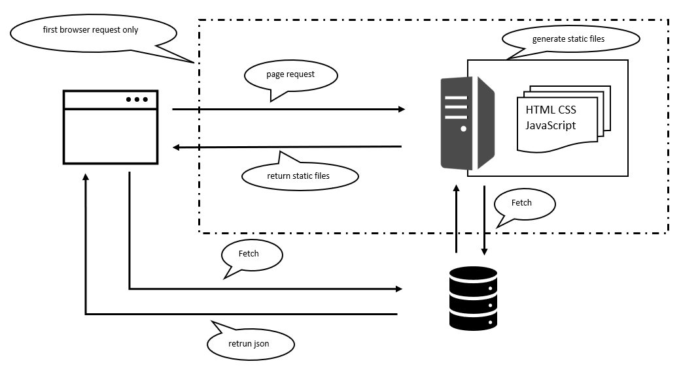

# React SPA with SSR rendering tutorial

## 概要
初回レンダリングをサーバー側で行い、その後、Hydration という工程を得て SPA として同じページを使いまわす。

### Hydration とは
- SSR で得たコンテンツを、SPA で使いまわすこと

## 概念図

## なにをやっているか
- server side
  - コンポーネントツリーをHTMLの文字列にしてレスポンスする
  - コード：ReactDOMServer.renderToString | renderToNodeStream
- client side
  - 前提）SSR が返したHTMLでDOMが描画済み
  - DOM の差分チェックを行い、イベントハンドラーの設定を行う
  - コード：ReactDOM.hydrateRoot

> Note
>
>参考にさせてもらった記事
>
>[link_1](https://qiita.com/MasanobuAkiba/items/7adcfd5050150ac9ba36)
