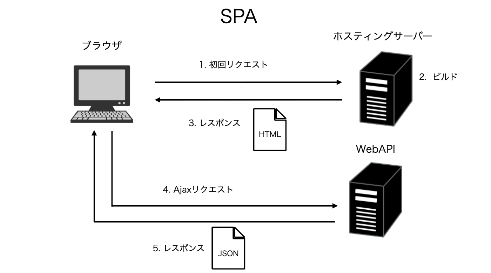

# React SPA rendering tutorial

## 概要
初回のみ１つのページをサーバーから取得して、そのページを元に変更したい差分のデータをAPIから取得し描画を行うアーキテクチャ。

## 概念図
ページを取得してくるのは初回のみとなっており、2回目以降はAPIからデータを受け取ることで差分箇所のみ置き換える

## Pros/Cons
- 変更箇所のデータ取得と更新のみのため、ページ遷移などの際にかかる時間が少なくなり、ユーザーの操作感が向上する（UI/UX的な話は除く）。
また、ブラウザ側でできる処理はJavaScriptに任せることで、サーバとの通信量を最低限に抑えることが可能になる。

- SPAはユーザーのアクションに対して必要な部分のみを更新する。
これにより、ブラウザの挙動に縛られることがなく、幅の広いUIを実装することができます。

  eg.ブラウザによるページ遷移が発生しないことにより、BGMを流しながらページ遷移等を実現できる。また、Twitter や Facebook などのようにプッシュ型の通知を提示することもできます。Facebookのように「チャットウィンドウは表示したまま表示しているコンテンツを変更する」などの機能を実現することができます

- 初回に必要なJavaScriptのコード量は増加するので初期ローディングに時間がかかってしまう。

## 開発において気をつけること
- react-router のルーティング設定だけでは、エントリポイント以外を直撃ちすると、404 error となる。

  これは、ルーティングがサーバーにルーティングが設定されているわけではなく、クライアント上でのページ遷移（History API による URL の書き換え）だからです。

- URL を直接指定しても目的のページを表示させるようにするには、サーバでフォールバックを設定が必要になります。
  eg. webpack-dev-server であるならば historyApiFallback: true を設定する。nginx、Express などで History API利用時のフォールバックを設定する等。

> Note
>
>参考にさせてもらった記事
>
>[link_1](https://zenn.dev/rinda_1994/articles/e6d8e3150b312d#spa)
