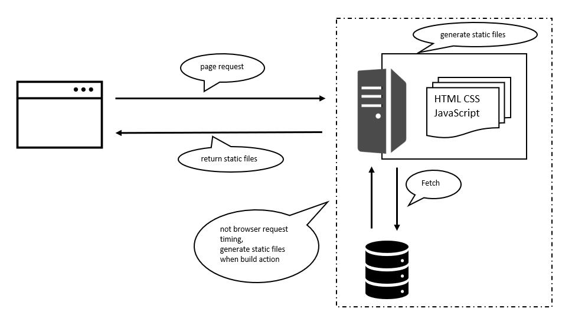

# React SSG rendering tutorial

## 概要
ビルド時などに、サーバー側でページごとに静的な HTML ファイルとして作成し、ユーザーからリクエストされた際に作成した HTML を渡すアーキテクチャ。

この「サーバー側で先にレンダリングを行う」ことを「プリレンダリング」と呼んでいる。

Next.js は推奨している方法でもある。

## 概念図

## Pros/Cons
- 事前に生成した HTML ファイルをレスポンスとして返すだけなので処理が非常に速い。
- (google のクローラーが進化したから怪しいけど) 一般的に SEO に強いとされる。
- ページ数が多くなればなるほど、事前に生成する静的ファイルが多くなるため、ビルドに時間がかかる。
- ページの内容の変更する場合は静的ファイルを再作成する必要があるため、リアルタイムな更新には弱い。そのため、更新頻度の少ないサイトやブログで使われることが多い。

> Note
>
>参考にさせてもらった記事
>
>[link_1](https://zenn.dev/rinda_1994/articles/e6d8e3150b312d#ssg)
