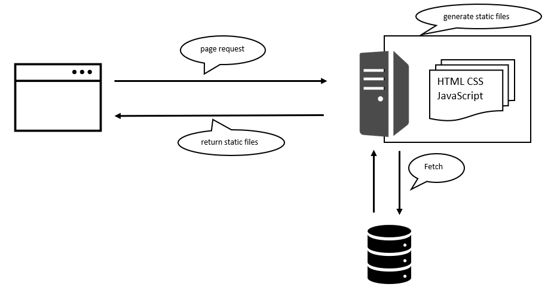

# React SSR rendering tutorial

## Server Side Rendering 概要

ページ遷移のたびサーバーにリクエストを送り、サーバー側でAPIなどと連携をしてレンダリング（HTMLを作ること）が行われ、HTMLをブラウザに返すアーキテクチャのこと。

サーバー側でレンダリングが行われるため、Server Side Rendering (以下SSR)と呼ばれています。

## SSRのメリット
### 初回描画速度が速い
サーバー側でレンダリングを行うため、重たい処理があっても高速である。
（クライアント側のスペックに意識する必要がない）

### ページごとの静的HTMLについて
検索エンジン以外のクローラーは JavaScript を実行できず、常に index.html の内容を認識します。
つまり、クライアント側での処理は反映されていない状態なため、SEO 的に弱くなっていると言えるようです。

ただ、google のクローラーは JavaScript が実行できたりするので、他のクローラーもアップデートされ、JavaScript を実行してくれるようになれば SEO 観点からの SSR は不要になるかもしれません。

また、静的HTMLは CDN でキャッシュ可能というメリットもあります。

## 従来型のWebアプリ
.NETやjavaなどのサーバーサイドフレームワークを使った従来型のWebアプリも、SSR同様にサーバー側でHTMLを作ってブラウザに返しています。

ただ、呼び方は Multi page application (以下MPA) という言葉が使われています。

## なぜ呼び分けがされているのか
SSR という言葉は Single Page Application (以下SPA)を構築する際のオプション機能を指すようです。

オプションというのは SPA を構築する上で必須ではないからです。

つまり、SSRは、それ単体で使用されるというより、SPAと組み合わせて使用されるアーキテクチャであるようです。

## SSR概念図

> Note
>
>参考にさせてもらった記事
>
>[link_1](https://zenn.dev/rinda_1994/articles/e6d8e3150b312d#ssr)
>
>[link_2](https://qiita.com/MasanobuAkiba/items/7adcfd5050150ac9ba36)
